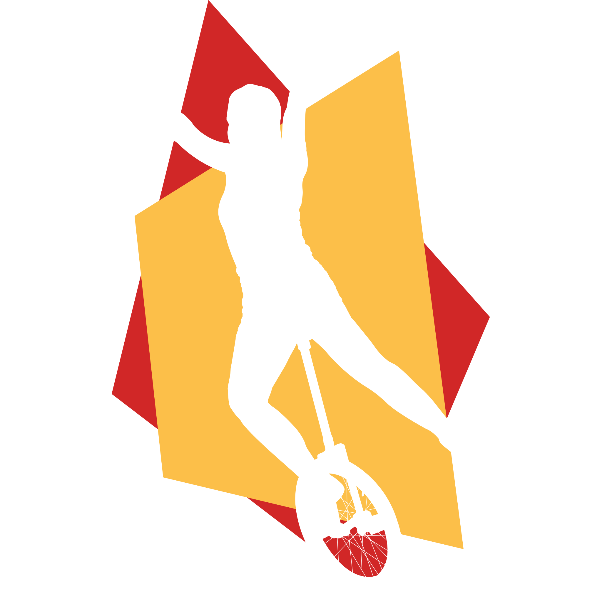

# Design Guide

## Farben

Wir verwenden die folgenden Farben:

### Hauptfarben

- 

 #003049 "ODM Blau"
- 

 #d12727  "ODM Rot"
- 

 #fcbf49 "ODM Gelb"

"ODM Blau" darf als Hintergrundfarbe genutzt werden.

"ODM Rot" und "ODM Gelb" sollten als Hintergrundfarbe vermieden werden, außer es handelt sich um Warnungen.

Werden alle drei Hauptfarben zusammen genutzt (zum Beispiel als Trenner), so ist "ODM Rot" IMMER in der Mitte.
In diesem Falle ist es zu bevorzugen, dass die Farben in der Leserichtung Oben nach Untern, Links nach Rechts in der Reihenfolge "ODM Blau", "ODM Rot", "ODM Gelb" vorkommen.

#### Richtig

#### Falsch

### Auf hellem Untergrund

- 

 #181a1b "Textfarbe"
- 

 #f2f2f3 "Hintergrund" (Darf auf Papier durch rein weiß '#ffffff' ersetzt werden)
- 

 #d7d9dB "Hintergrund Nuanciert"

### Auf dunklem Untergrund

- 

 #d7d9dB "Textfarbe"
- 

 #181a1b "Hintergrund"

## Logo

Das Logo existiert in drei Varianten:

### Hell

Dies ist unser "Standardlogo". Wenn es keinen Grund gibt eine Andere Variante zu nutzen, nutzen wir dieses Logo.
Wir versuchen das Logo auf "ODM Blau" zu platzieren und ringsrum einen Rahmen von mindestens einer doppelten Schrifthöhe Platz zu anderen Elementen zu lassen.

Wir bevorzugen "ODM Blau", damit unsere drei Hauptfarben zusammen erscheinen und unsere "Marke" einfach wiederzuerkennen ist.

### Dunkel mit Schatten

Auf hellen oder transparenten Hintergründen verwenden wir standardmäßig das helle Logo mit Schatten.
Der Schatten verankert das Logo im Raum und stellt eine Basis für das Logo.

### Dunkel

Das Dunkle Logo verwenden wir auf hellen oder transparenten Hintergründen, auf denen der Schatten störend wäre.

## Ecken

Unser Design hat Ecken. Ecken werden bei uns nicht abgerundet.

### Richtig

### Falsch

## Winkel

Wir halten uns allgemein an 90° Winkel.

Als stilistisches Element darf ein 7° Winkel für die Farbreihenfolge "ODM Blau", "ODM Rot", "ODM Gelb" genutzt werden.

### Richtig

(In Ausnahmefällen:)

### Falsch

## Icons

Für Icons verwenden wir [Google Material Icons](https://fonts.google.com/icons), möglichst in gefüllter Form.

## Schriftart

Als Schriftart verwenden wir die variable Schriftart [Mona Sans](https://github.com/mona-sans).

## Rahmen

Wir verwenden normal keine Rahmen.
In Dokumenten, die von Teilnehmern oder in großer Stückzahl gedruckt werden, dürfen Hintergrundfarben durch Rahmen ersetzt werden.

### Richtig

Für Druck:

### Falsch

